import Row from "@site/src/components/Row"
import Column from "@site/src/components/Column"
import Image from "@site/src/components/Image"

# Chapter 1: Platform

## Platform Overview

EASYProcess is a software development platform which supports building with both no-code/low-code tools. It can be used to build  web apps, mobile apps, REST APIs, and batch applications.

Some examples of apps that can be built with EASYProcess include:

{/* - Web Apps
  - Vendor On-Boarding
  - eCommerce
  - AP Invoice Automation with OCR
- Mobile Apps
  - PO Approval
  - Customer Self Service (CSR)
  - PO Receive
- REST APIs
  - Inbound Sales Order API
- Batch Processes
  - Upload Shopify orders to JDE

 */}

<Row centered>
  <Column>
    <Row centered>**Web Apps**</Row>
    - Vendor On-Boarding
    - eCommerce
    - AP Invoice Automation with OCR
  </Column>
  <Column>
    <Row centered>**Mobile Apps**</Row>
    - PO Approval
    - Customer Self Service (CSR)
    - PO Receive
  </Column>
  <Column>
    <Row centered>**REST APIs**</Row>
    - Inbound Sales Order API
  </Column>
  <Column>
    <Row centered>**Batch Processes**</Row>
    - Upload Shopify orders to JDE
  </Column>
</Row>
<Image src={require("/img/devops.png").default} style={{ width: "364.81px", height: "188.50px" }} />

The EASYProcess platform provides built-in DevOps end-to-end, covering requirements gathering, work assignment, one-click deployments, and production monitoring.

The platform has both no-code and low-code tools and utilities. A typical app in EASYProcess can be developed with both no-code and low-code tools. An IT department should use the no-code and low-code in tandem to its advantage by assigning proper resources to each side.

<Row centered>
  <Column>
    <Row centered>**No-Code**</Row>
    - Designed to be used by business analysts, solution designers and architects, or those in similar roles with little or no coding/programming experience.
    - Uses an innovative workflow driven business process framework to create web applications.
    - Lets you draw an entire application using a workflow canvas.
    - Helps to visualize an application and then progress through EASYProcess-guided building.
    - Creates inquiry-only apps quickly using no-code tools such as Grid and Info Widgets.
  </Column>
  <Column>
    <Row centered>**Low-Code**</Row>
    - Designed to be used by programmers or those in similar roles. Programmers can also easily use the no-code tools.
    - Provides a more traditional programming paradigm where developers have full control over the entire development process.
    - Nearly any app can be built with low-code.
    - K-Rise-owned B2B/B2C EASYCommerce, EASYPay/JDE Credit Card Payment, AP Automation, and Digital Shopfloor/Warehouse apps are all built using low-code.
  </Column>
</Row>

This is the Low-Code User Guide. To learn no-code, refer to the [No-Code User Guide](/docs/category/no-code-user-guide).

---

## Infrastructure

### 5 Key Points to Know about the EASYProcess Infrastructure:

1. **SaaS Cloud-Based Platform**: EASYProcess is hosted in the cloud, meaning that users don't need to install it on their computers or manage physical servers. It’s available over the internet, similar to other cloud-based tools (like Google Docs or Salesforce).
2. **Google Chrome / Microsoft Edge Based Development Tools**: All the tools required for development within EASYProcess are accessed through the browser, designed to work within Google Chrome/Microsoft Edge.
3. **Multi-Tenant Setup**: This means that multiple customers (tenants) share the same infrastructure and platform, but each customer is assigned its own tenant and is isolated from the others in terms of their data and settings.

    Note: A **tenant** in EASYProcess refers to your organization’s dedicated space within the platform. It includes all the applications, data, users, and configurations specific to your environment. Each tenant is isolated, meaning your setup and data are separate from other organizations using EASYProcess.

    There are licensing options to have your own dedicated infrastructure.

4. **Multiple Applications Inside a Tenant**: Once your company is assigned its tenant, you have the flexibility to create multiple applications.
5. **License Determines Application Limits**: The number of applications you can create and how large (in terms of complexity, data, or features) these applications can be, is based on the type of license you have purchased.

K-Rise has deployed platforms worldwide, and you will be assigned to the instance closest to your JDE system, ensuring minimal latency for both JDE and other on-premises resources.

{/*  */}
{/*  */}
<Image src={require("/img/tenant.png").default} style={{ width: "624.00px", height: "292.59px" }} />

<Row centered>
  <Column>
    Each tenant offers three environments:

    1. **DV**: Used for development
    2. **QA**: Used for testing
    3. **PD**: Used by end-users (customer-facing live environment)
  </Column>
  <Column>
    Each environment is further divided between:

    1. **Design time (DV/IDE)**: Where development occurs
    2. **Runtime (RT)**: Where the application runs and end-users interact with the built application.
  </Column>
</Row>

---

## Upgrades

All EASYProcess platforms are fully SaaS and are upgraded biweekly (every two weeks). Typical upgrade schedule:
- **Monday**: IDE, DV, QA
- **Wednesday**: PD

Upgrade schedules and release announcements are posted in the [K-Rise Product Announcement Forum](https://forum.krisesystems.com/viewforum.php?f=5).

{/*  */}
<Image src={require("/img/forum-register.png").default} />

Select **Register** in the upper-right corner to get started. Once logged in, scroll to the bottom of the forum and Subscribe to receive email notifications.

{/*  */}
<Image src={require("/img/forum-subscribe.png").default} />

Current Design Time and Runtime revisions can be viewed in the IDE by navigating to **Home Page** under **Versions**.

{/*  */}
<Image src={require("/img/menu-versions.png").default} />

---

## EASYProcess App Suite

You will use EASYProcess to create multiple applications within your tenant.

**EASYProcess App Suite (EAS)** serves as the central entry point for all platform applications.  Whether you're a user or a developer, you will always start by logging into EAS.

Once inside, you’ll see a list of applications available to you—only those where you have the necessary roles or permissions will appear in this list.

{/* 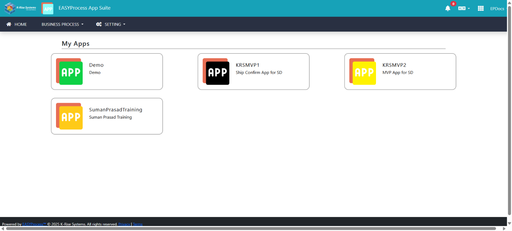 */}
<Image src={require("./img/app-suite.png").default} style={{ width: "624.00px", height: "282.67px" }} />

**My Apps** are developer-created apps that serve their customers or company’s internal users. All newly created applications are placed under this category. 

**Platform Apps** support developer-created apps. These include the “Security” and “Connector” apps which control settings such as integration details for other systems and user maintenance.

- Users are defined in the Security App. This allows a single user to be able to login to any of the apps. Though it might only make sense to have a user that works in internal apps, since that user may not have a relevant role in customer-facing apps. This can be configured in each application’s User Management.
- Integrations, such as JDE connections and SMTP servers for sending emails, could be utilized by all applications, so they are set up within the Connector App.

{/*  */}
<Image src={require("/img/platform-apps.png").default} style={{ width: "395.50px", height: "395.50px" }} />
<Row centered>_IDE Structure Diagram_</Row>

The structure of how interconnected the users and applications are within a tenant is configurable and determined by the tenant owner.

---

## DesignTime/IDE

**DesignTime**, also known as the **IDE (Integrated Development Environment)**, is where developers, designers, solution architects, and business analysts build and customize applications using no-code and low-code tools.

Developers can be granted access to use no-code tools, low-code tools, or both, depending on their authorization type within the IDE.

Once you're registered on the platform, you'll receive an email invitation with a link to the IDE.

### EASYProcess App Suite (EAS) Home Page

In the header, clicking the EASYProcess App Suite will show you all the applications you have access to develop within.

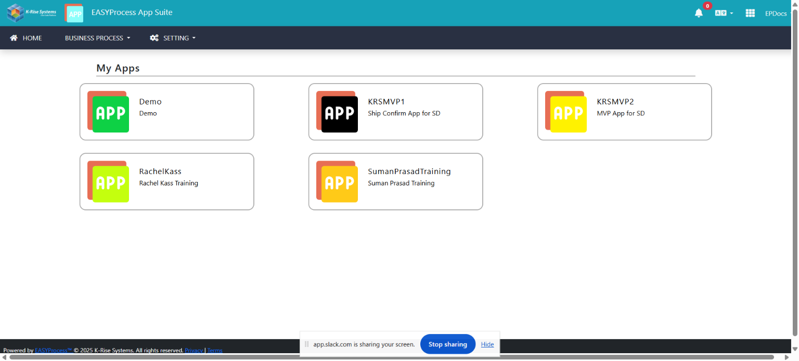

### IDE Menu/Home Page

After selecting an application, the home page will show all the IDE pages you have access to for your development. These will differ based on the developer’s access to low-code and no-code tools.

The application name in the header informs developers which application they are developing within.

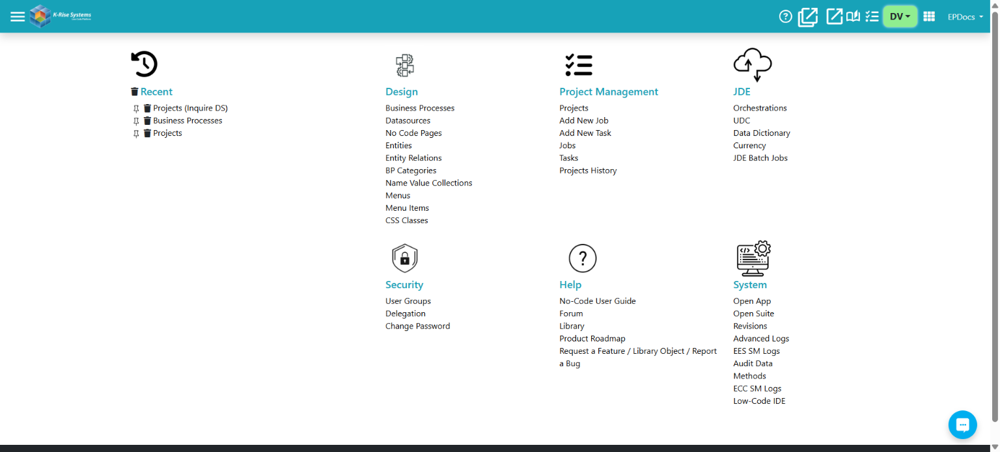

---

## RunTime

**RunTime** is how end users interact with apps that you are developing. Just like Design Time, there are DV, QA and PD environments for the RunTime.

Here are some important facts to note about the RunTime:
- To open the RunTime app, you will first start from the Design Time IDE.
- The Design Time environment you are in will be the same environment when you open the RunTime app. So, opening the RunTime app from the DV Design Time will open the DV RunTime app.
- The RunTime environment is separate from design time and you will have to login separately.
- By default, RunTime apps allow Design Time users to login. However, a developer-user may not have access to perform actions in a runtime app. This can be configured by the application owner.
- You will have to login again for each environment you switch to in both Design Time and RunTime.

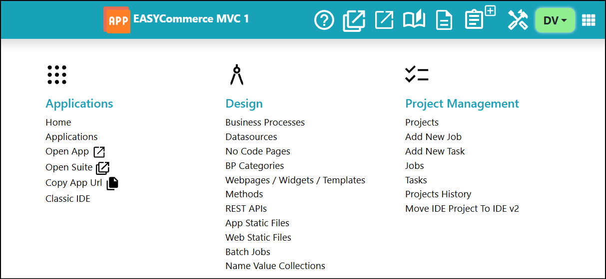

There are two ways you can open a RunTime app:

<Row centered>
  <Column>
    1. **Shortcut in the Header**

        
  </Column>
  

  <Column>
    2. **From the Menu**

        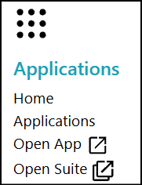
  </Column>   
</Row>

After opening the RunTime app, you will land at the login screen.

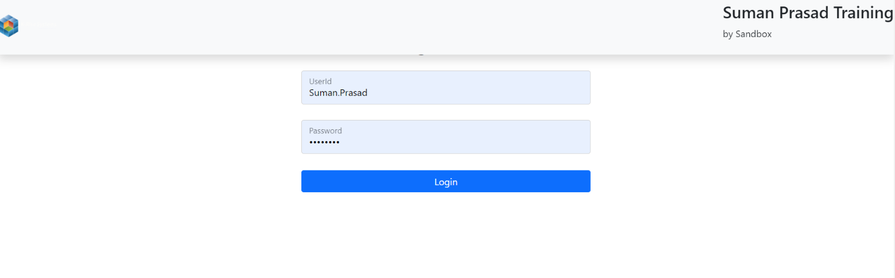

---

## Mobile App

You can access **EASYProcess** apps as a Mobile app.

1. On your mobile device, navigate to your app store.
2. Download the **EASYProcess** app from the iOS or Android store.

    <Row centered>
      {/* 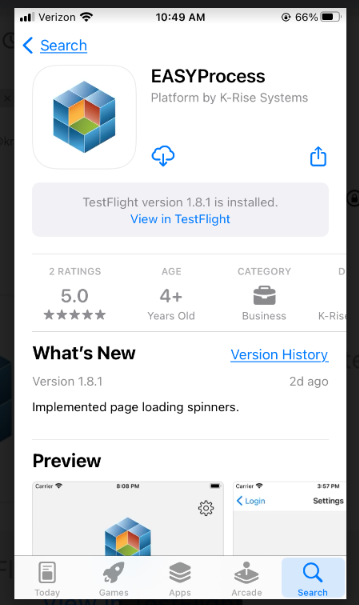 */}
      <Column>
        <Image src={require("./img/app-store.png").default} style={{ width: "171.50px", height: "289.28px" }} />
        *EASYProcess app within the App Store*
      </Column>

      <Column>
      {/* 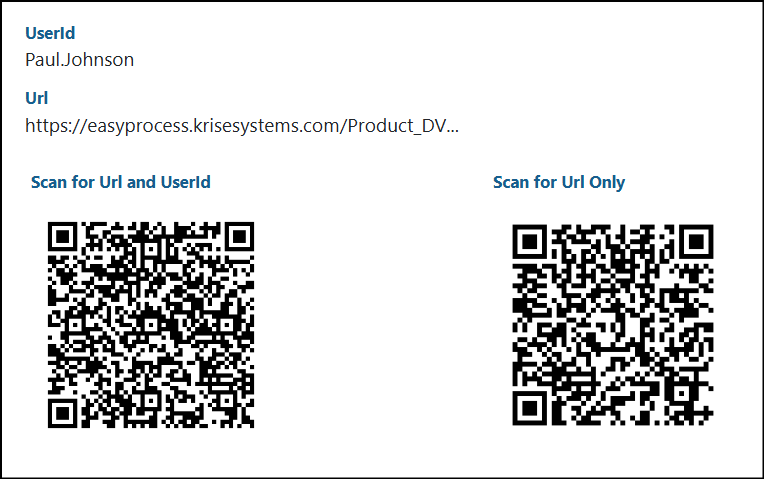 */}
        <Image src={require("./img/register-device.png").default} style={{ width: "339.50px", height: "212.85px" }} />
        _Settings/Register Device page within the App Suite app runtime_
      </Column>
    </Row>

3. Locate the QR code
    - It will be sent in the registration email for the platform.
    - Alternatively, you can also open App Suite app runtime and then find Settings/Register Device within the menu.
4. Go back to your device and open the EASYProcess app. If you open the EASYProcess app for the first time, it should automatically take you to the settings page where you can scan the QR code.

    <Row centered>
      <Column>
        {/* 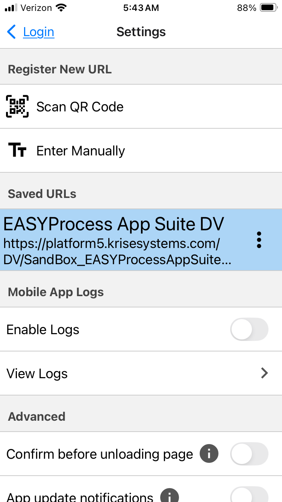 */}
        <Image src={require("./img/mobile-app-settings.png").default} style={{ width: "216.42px", height: "384.00px" }} />
        _Settings within the EASYProcess app_
      </Column>
      

      <Column>
        {/* 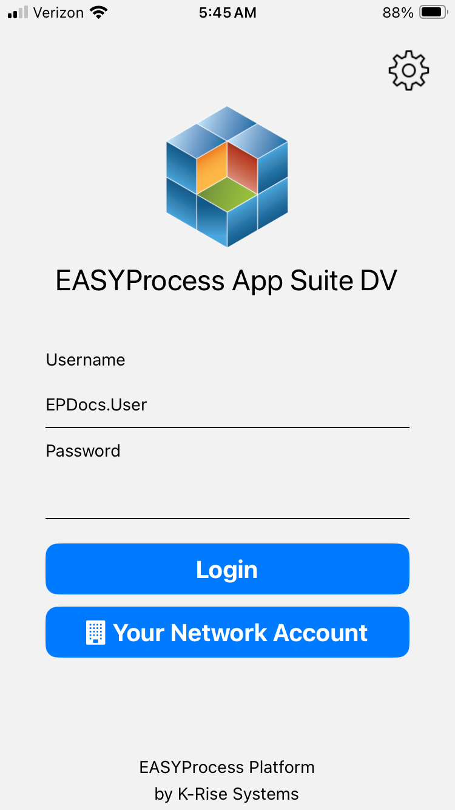 */}
        <Image src={require("./img/mobile-app-login.png").default} style={{ width: "216.12px", height: "384.00px" }} />
        _Login screen within in the EASYProcess app_
      </Column>
    </Row>

5. Click **Scan QR Code** within the app and scan the QR code located in step 3.
6. After scanning the QR code, click the Login link on top left to go back to the login page.
7. Your user name will be filled in automatically as it was part of the QR code. Enter your password and click Login.
8. After login, you will be taken to the app home page.
9. You can return to the **Settings** by clicking the button on the top right of the login page to re-scan the registration url. The Settings page allows you to scan QR codes to register multiple environments/apps. You can switch between registered environments/apps here. As an app developer, this will allow you to test apps in different environments.
10. You can also enable logs on the Settings page. This will allow the app to create diagnostic information that you can view and then send to our app development team for troubleshooting.
    <Row centered>
      <Column>
        {/* 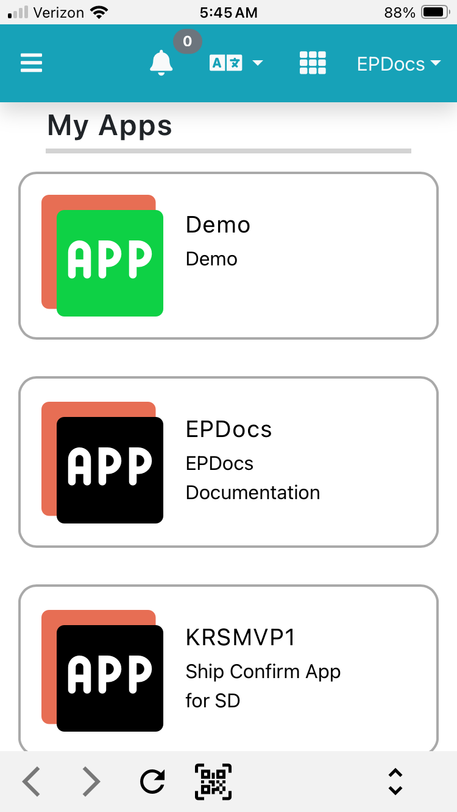 */}
        <Image src={require("./img/mobile-app-eas.png").default} style={{ width: "215.56px", height: "384.00px" }} />
        _The Home Page of the App Suite (EAS) within the EASYProcess app_
      </Column>
      <Column>
        {/*  */}
        <Image src={require("./img/mobile-app-saved-apps.png").default} style={{ width: "216.44px", height: "384.00px" }} />
        _View of the Settings within the EASYProcess app. Two apps are saved, one for DV environment and one for QA environment. This is a common usage for a developer who would be working in both._
      </Column>
    </Row>

---

## Platform Access

When a user is added to the EASYProcess platform, they receive email as below.

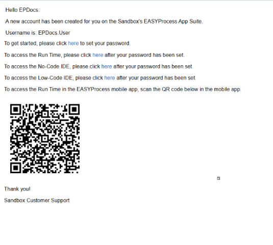

### DesignTime/RunTime Login Links

This email contains links to the following:

- **Password Set Link** - Before you begin as a developer or a user, you must set a password.
- **DesignTime/IDE: No-Code** - Login Url for EASYProcess App Suite (EAS) no-code development environment. You will only get this link if you have a no-code development role.
- **DesignTime/IDE: Low-Code** - Login Url for EAS low-code development environment. You will only get this link if you have a low-code development role.
- **RunTime** - Login Url for EAS run time environment. If you are an end user and not a developer, you will only get this url.

As you will notice, every login/entry point is through EAS. This makes it easy for you to navigate across multiple apps as a developer or as an end user.

### Mobile App
There is a QR code at the bottom of the email. You will scan this QR code to setup  EASYProcess native app for EAS.

### Multiple Environments
You will get email for each environment separately. Subject line “DV New User Creation” will designate which environments DV/QA/PD it belongs to. In EASYProcess, each environment has its own security. You can be a developer in DV while having no-access to other environments. You can be a user in PD while having no access to the other environments. This is controlled by the application owner.

---

## Navigation

There are three environments in EASYProcess and each includes a Design Time IDE as well as RunTime interface. This means you will be working with up to six different URls across the platform.

<Row centered>
  <table>
    <tbody>
      <tr>
        <td style={{ backgroundColor: "#93c47d", borderColor: "black" }}>
          
DV (Development)

          
**DesignTime**

        </td>
        <td style={{ backgroundColor: "#ffff00", borderColor: "black" }}>
          
QA (Quality Assurance)

          
**DesignTime**

        </td>
        <td style={{ backgroundColor: "#ea9999", borderColor: "black" }}>
          
PD (Production)

          
**DesignTime**

        </td>
      </tr>
      <tr>
        <td style={{ backgroundColor: "#93c47d", borderColor: "black" }}>
          
DV (Development)

          
**RunTime**

        </td>
        <td style={{ backgroundColor: "#ffff00", borderColor: "black" }}>
          
QA (Quality Assurance)

          
**RunTime**

        </td>
        <td style={{ backgroundColor: "#ea9999", borderColor: "black" }}>
          
PD (Production)

          
**RunTime**

        </td>
      </tr>
    </tbody>
  </table>
</Row>

Based on your role, you may work in any one of the six. You may even work in multiple and need to switch between them. We recommend you to bookmark DesignTime/IDE DV EAS login url. From the EAS, you can access all other environments, applications, and tools.

Once you log in to the EAS, you will see the following screen:

<Image src={require("./img/app-suite-2.png").default} style={{ width: "624.00px", height: "282.67px" }} />

### Useful Shortcuts

Shortcut icons can be seen in the Design Time (IDE) menu header. Below are some useful shortcuts you will use once you begin development.

<Row centered>
  <Column>
    <Row centered>**Environment Switcher**</Row>
    <Row centered>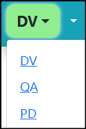</Row>
  </Column>
  <Column>
    <Row centered>**Open RunTime**</Row>
    <Row centered></Row>
  </Column>
  <Column>
    <Row centered>**Application Switcher**</Row>
    <Image src={require("./img/app-switcher.png").default} style={{ width: "142.00px", height: "126.67px" }} />
  </Column>
  <Column>
    <Row centered>**App Suite (EAS)**</Row>
    <Row centered>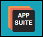</Row>
  </Column>
</Row>

---

## Exercise: Setup Platform Access

In this exercise, we will create access to each environment DV,QA and PD, learn navigation, and set up the EASYProcess Native/Mobile App.

1. Password - Setup a password in each environment. Each environment has a separate password so you must remember each password individually.
2. Login
    - EASYProcess App Suite (EAS) in the DesignTime/IDE for the DV environment (bookmark this URL).
    - EASYProcess App Suite (EAS) in Run Time
3. Navigation - Using the bookmarked url, navigate to the following part of the platform:
    - EAS QA IDE
    - EAS PD IDE
    - EAS DV RT  
    - EAS QA RT  
    - EAS PD RT
4. Mobile App Setup
    - From the QA and PD runtime for the App Suite, find the QR code to set up the mobile app.
    - Download the **EASYProcess** app from the iOS or Android store.
    - Scan the QR code for both environments and name them appropriately so you can tell the difference between the two.
    - Select QA from your saved apps and return to the login screen. Your user name will be filled in automatically as it was part of the QR code. Enter your password and click Login.
    - After login, you will be able to use that registered app on your smartphone and will begin receiving push notifications for your user.
    - Return to the **Settings** to switch the selected app to PD. Make sure you can login to both environments using the mobile app.

---
